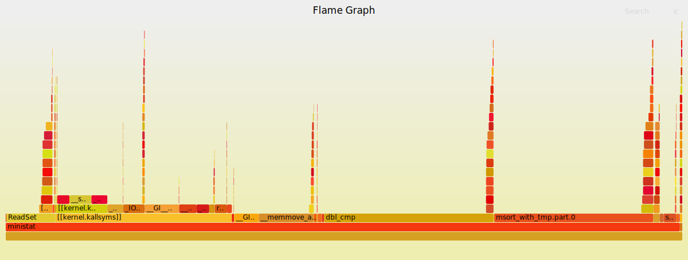
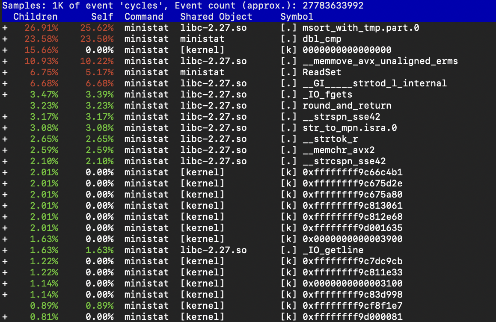

# Senior Design Project

## Group B

## Team Members: 
Eftekher Husain, 
Jeffrey Lei, 
Jessica Chu, 
Jiande Li, 

#### GitHub Link --> https://github.com/SD-CSC59866/ministat

## Our Goal

Optimize ministat to take advantage of modern CPU features and compiler optimizations.

### Performance before Optimization

	$ perf record -F 99 -g ./ministat/ministat -q ./desktop.txt ./game.txt
	
	Couldn't record kernel reference relocation symbol
	Symbol resolution may be skewed if relocation was used (e.g. kexec).
	Check /proc/kallsyms permission or run as root.
	x ./desktop.txt
	+ ./game.txt
	    N           Min           Max        Median           Avg        Stddev
	x 15863880             1 1.5813409e+09             4     76146.461     4043837.6
	+ 19992880             1 1.6039039e+09           868     166282.14      15806022
	Difference at 95.0% confidence
		90135.7 +/- 7977.54
		118.371% +/- 10.4766%
		(Student's t, pooled s = 1.21051e+07)

### Flamegraph before optimizations

	$ ./ministat/FlameGraph/flamegraph.pl out.perf-folded > perf-ministat.svg

### Perf Report before optimizations

	$ perf report --input=./perf.data -f

### Performance after Optimization

	$ perf record -F 99 -g ./ministat/ministat -q ./desktop.txt ./game.txt

### Flamegraph after optimizations

### Perf Report after optimizations

	$ perf report --input=./perf.data -f

### Steps we have taken in order to Optimize ministat

#### 1) Micro-optimizations

- [x] We changed the way AddPoints inserted new data points by using realloc. Realloc replaced calloc and memcpy so there's no need to spend time copying the new set of points.

- [x] We replaced the usage of qsort with a variant of it, an_qsort, for a faster sorting algorithm for the data set.

- [x] For the ReadSet function, we use open, read and close to instead fopen, fget and fclose.

- [x] We use changed the tokenization (using strsep to instead strtok).

#### 2) Multi-threading

- [ ] We attempted to create a multi-threaded architecture to split the work of ReadSet across multiple threads but were unsuccessful

#### Conclusion

 ministat originally wasn't the most optimized piece of software. However, the micro-optimizations we made to ministat were within realistic expectations. 
