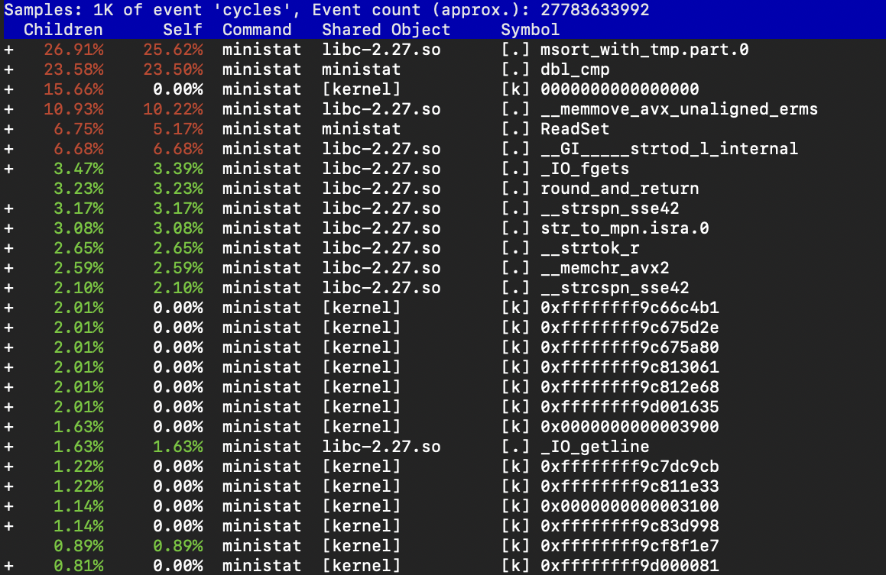

# Senior Design Project

## Group B

## Team Members: 
Eftekher Husain, 
Jeffrey Lei, 
Jessica Chu, 
Jiande Li, 

#### GitHub Link --> https://github.com/SD-CSC59866/ministat

## Our Goal

Optimize ministat to take advantage of modern CPU features and compiler optimizations.

### generating a flamegraph

	$ perf record -F 99 -g ./ministat/ministat -q ./desktop.txt ./game.txt
	
	Couldn't record kernel reference relocation symbol
	Symbol resolution may be skewed if relocation was used (e.g. kexec).
	Check /proc/kallsyms permission or run as root.
	x ./desktop.txt
	+ ./game.txt
	    N           Min           Max        Median           Avg        Stddev
	x 15863880             1 1.5813409e+09             4     76146.461     4043837.6
	+ 19992880             1 1.6039039e+09           868     166282.14      15806022
	Difference at 95.0% confidence
		90135.7 +/- 7977.54
		118.371% +/- 10.4766%
		(Student's t, pooled s = 1.21051e+07)
	[ perf record: Woken up 1 times to write data ]
	[kernel.kallsyms] with build id cf4038e5f8e52a65ec13b1084be8dead7cf85258 not found, continuing without symbols
	[ perf record: Captured and wrote 0.089 MB perf.data (1275 samples) ]

	$ perf script | ./ministat/FlameGraph/stackcollapse-perf.pl > out.perf-folded
	[kernel.kallsyms] with build id cf4038e5f8e52a65ec13b1084be8dead7cf85258 not found, continuing without symbols

	$ ./ministat/FlameGraph/flamegraph.pl out.perf-folded > perf-ministat.svg

### Flamegraph Before optimizations

### Perf Report Before optimizations

	$ perf report --input=./perf.data -f

### Flamegraph After optimizations

### Perf Report After optimizations

	$ perf report --input=./perf.data -f

### Steps we have taken in order to Optimize ministat
