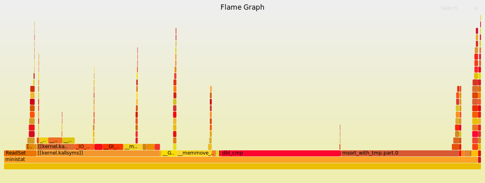

# Group B

## Team Members: 
Eftekher Husain, 
Jeffrey Lei, 
Jessica Chu, 
Jiande Li, 

# ministat
A small tool to do the statistics legwork on benchmarks etc.

Written by Poul-Henning Kamp, lured into a dark Linux alley and clubbed over the head and hauled away to Github by yours truly.

### generating a flamegraph

	$ perf record -F 99 -g ./ministat/ministat -q ./desktop.txt ./game.txt
	
	Couldn't record kernel reference relocation symbol
	Symbol resolution may be skewed if relocation was used (e.g. kexec).
	Check /proc/kallsyms permission or run as root.
	x ./desktop.txt
	+ ./game.txt
	    N           Min           Max        Median           Avg        Stddev
	x 15863880             1 1.5813409e+09             4     76146.461     4043837.6
	+ 19992880             1 1.6039039e+09           868     166282.14      15806022
	Difference at 95.0% confidence
		90135.7 +/- 7977.54
		118.371% +/- 10.4766%
		(Student's t, pooled s = 1.21051e+07)
	[ perf record: Woken up 1 times to write data ]
	[kernel.kallsyms] with build id cf4038e5f8e52a65ec13b1084be8dead7cf85258 not found, continuing without symbols
	[ perf record: Captured and wrote 0.089 MB perf.data (1275 samples) ]

	$ perf script | ./ministat/FlameGraph/stackcollapse-perf.pl > out.perf-folded
	[kernel.kallsyms] with build id cf4038e5f8e52a65ec13b1084be8dead7cf85258 not found, continuing without symbols

	$ ./ministat/FlameGraph/flamegraph.pl out.perf-folded > perf-ministat.svg

### Flamegraph

	$ perf report --input=./perf.data -f

## Build & Install

There should be no dependencies besides the standard libraries and a functional tool-chain.

	$ cd ministat/
	$ make
	$ make PREFIX=/usr install
	install -m 0755 ministat  /usr/bin/ministat

## Usage
The FreeBSD man page is very relevant, pursue it [here](http://www.freebsd.org/cgi/man.cgi?ministat).

	Usage: ministat [-C column] [-c confidence] [-d delimiter(s)] [-ns] [-w width] [file [file ...]]
		confidence = {80%, 90%, 95%, 98%, 99%, 99.5%}
		-C : column number to extract (starts and defaults to 1)
		-d : delimiter(s) string, default to " \t"
		-n : print summary statistics only, no graph/test
		-q : print summary statistics and test only, no graph
		-s : print avg/median/stddev bars on separate lines
		-w : width of graph/test output (default 74 or terminal width)

## Example
From the FreeBSD [man page](http://www.freebsd.org/cgi/man.cgi?ministat)

	$ cat << EOF > iguana
	50
	200
	150
	400
	750
	400
	150
	EOF

	$ cat << EOF > chameleon
	150
	400
	720	
	500
	930
	EOF

	$ ministat -s -w 60 iguana chameleon
	x iguana
	+ chameleon
	+------------------------------------------------------------+
	|x      *  x	     *	       +	   + x	            +|
	| |________M______A_______________|			     |
	| 	      |________________M__A___________________|      |
	+------------------------------------------------------------+
	    N	  Min	     Max     Median	   Avg	     Stddev
	x   7	   50	     750	200	   300	  238.04761
	+   5	  150	     930	500	   540	  299.08193
	No difference proven at 95.0% confidence
